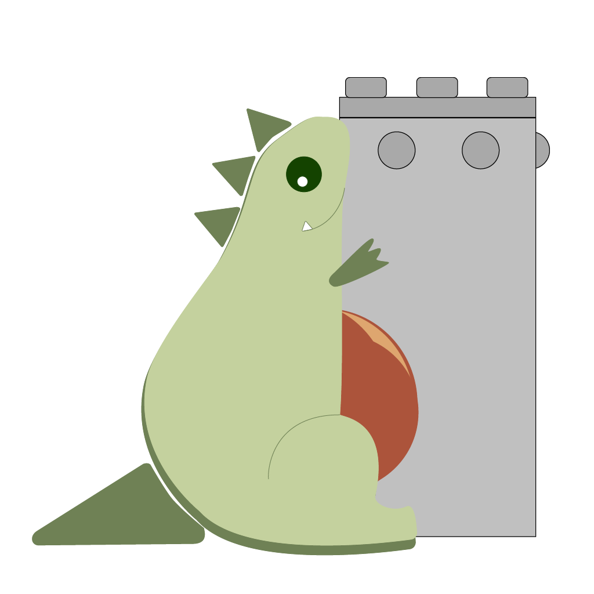

# DHy-n0
DHy-n0 is a a pipeline safety monitoring application built for the EOG Resources Challenge at HackUTD 2024.

## Inspiration
We wanted to create a hydrate detection tool that gives the user the best experience possible. We implemented viewing features that we thought would be helpful to us if we were the ones doing the job of lease operator.
## What it does
It takes in data about a well and tries to detect anomalies to predict when hydrate buildups might be happening.
## How we built it
Our tech stack includes Flask, Pandas, and React.
## Challenges we ran into
There were a lot of challenges we faced on frontend due to the fact we were all new to React. We decided to challenge ourselves to code the frontend in React anyway. We also felt challenged while implementing Recharts because it was a new library we hadn't used before, so we had to struggle through filling it out.

Analyzing and inferencing data was the main challenge on the backend. We also struggled with the uploading files feature as well as the API design for integrating our backend and frontend.
## Accomplishments that we're proud of
We're proud of the marketing we did for this product. We wanted to find a creative way to promote our product, so we made a silly video that displayed our website in a light-hearted way. We also created an original mascot for our project. We thought branding and design is often overlooked in tech applications, so we wanted to go against the grain and create an identity for our application. 

We're also extremely proud of taking a small idea and turning it into an actual product that can solve real-world issues. Going from ideas to code was extremely difficult at times, but we managed to create a product we're all proud of.
## What we learned
We all learned a lot more about the tech stack we used and how to overcome problems in coding with creative solutions.

More specifically, we learned how to use callbacks in React (and in fact all of us were new to React, especially in a major project), how to communicate and collaborate on time-sensitive work, how to use Pandas and its data frame model, how to adapt to changing requirements, and how to create friendly UI.
## What's next for DHy-n0
We would love to see how it handles more data, especially from the real world where anomalies might not necessarily indicate hydrate, but some other contributing factor.

We also want to see how these techniques we used can be applied to other projects.
